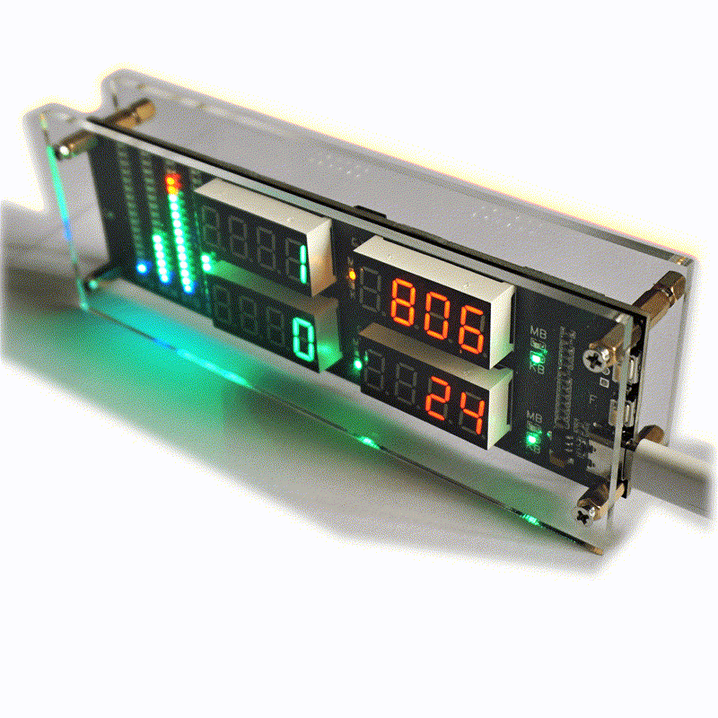

# Topuino

[English](doc/README_en.md)

[用户手册](doc/user_manual.md)

[开发者手册](doc/develop.md)

## 什么是 Topuino

Topuino 是一个桌面小摆件，可以显示服务器或电脑的项性能监控数据，包括 CPU 占用、RAM 占用、两个硬盘的可用空间、硬盘读写速度、网络 IO 速率。

## 为什么叫 Topuino

在 Linux 系列服务器上，通常使用 top 命令查看 CPU 内存占用，本项目最初的设想也是将 top 命令实物化，这就是 Topuino 中 Top 的由来。

在选型的时候，为了兼顾开发效率和成本，项目选用了大名鼎鼎的 ESP8266 单片机，配合了 Arduino 开发框架，Arduino 则是 Topuino 中 uino 的由来。

## 快速上手

将 Topuino 通过 USB 线连在 Windows 电脑上，运行 Windows 客户端，即可显示当前 Windows 电脑的各项性能监控数据。

## Topuino 的工作原理

Topuino 可以工作在三种模式下，分别为 USB 模式、在线模式和本地模式，可通过按键在三个模式间切换。

### USB 模式

Topuino 自带一个 USB 转串口芯片，客户端扫描连接到本机的串口，如果扫描到 Topuino，就会向它直接发送电脑性能监控数据，并显示在面板上。

### 在线模式

服务端使用了 Flask，维护一个内存数据库（实际上是 Python 的字典），保存着客户端（被监控服务器）UUID 与运行参数的映射关系。服务端接收客户端的性能监控数据，并向 Topuino 回传数据。

### 本地模式

在本地模式下，连接上 WiFi 后的 Topuino 会显示其自身的 IP。在填写好 Topuino 的 IP 后，客户端就会以 UDP 的形式向 Topuino 发送性能监控数据。

更多信息请访问开头的用户手册和开发者手册。
